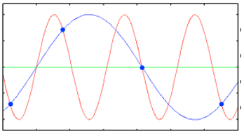

# Lyd

*https://www.freepik.com/vectors/background created by zaie - www.freepik.com*

## Lyd som spenning

Hvis du forsto prinsippet bak det å lage bilder, så er ikke lyd så veldig anderledes. Vi må på en eller annen måte få gjort lyd om til en rekke med tall, slik at disse igjen kan gjøres om til 0 og 1, ved å bruke totallsystemet. Da vil programmet som skal spille av lyden, kunne hente opp en lang rad med 0 og 1, for å så gjøre det om til den originale lyden igjen.

La oss derfor se nærmere på hva lyd egentlig er.

Du har kanskje sett en visuell representasjon før? Lyd defineres som vibrasjoner i blant annet luft, ofte kalt lydbølger. En mikrofon registrerer lydbølgene og lager tilsvarende elektriske signaler i form av spenning. Lydbølgene er dermed ulike spenninger over tid, og disse spenningene kan både måles og tegnes i form av en graf. Ved å jevnlig måle spenningen, og lagre den i riktig rekkefølge, vil vi kunne gjenskape grafen av den opprinnelige lyden:

Legg merke til at målingene vi gjør (ca 1.5s mellom hver), gir en elendig kvalitet. Her vil ikke vår versjon være i nærheten av den originale kilden engang. Det betyr at vi må gjøre målingene langt oftere, og antall målinger vi gjør kalles for *samplingsfrekvensen*. Til sammenligning har gamle CD-plater en samplingsfrekvens på 44.1 kHz, som tilsvarer 44 100 målinger i sekundet! Selv det er ikke nok dersom vi trenger virkelig god kvalitet på lyden vi skal lagre.

Du vet fra matematikken at dersom du har en graf, så har du også en verditabell (en tabell med alle x og y verdiene du har målt). I denne tabellen er altså lydbølgene gjort om til tall, og vi er i stand til å lagre lyden digitalt. Hvor stor plass denne tabellen tar, avhenger av hvordan vi komprimerer y-aksen, altså spenningsnivåene. Dersom vi kun har 4 bit tilgjengelig, må spenningene regnes om til en skala fra 0 til 15, og det går utover nøyaktigheten. CD-platen i eksempelet over brukte 16 bit, som ga 65 536 ulike y-verdier.

Tabellen med tid og spenning gjøres så om til totallsystemet. For CD-platen betyr det 16 bit ganger 44 100 målinger i sekundet som tilsvarer 705 600 bit per sekund. I stereo får vi det dobbelte, med andre ord 1 411 200 bit per sekund, eller 0.1764 megabytes per sekund.

## Ekstrastoff: Aliasing

Når vi rekonstruerer bilder eller lydbølger kan det oppstå et problem som gjør at to helt forskjellige kilder blir helt like, de danner *aliaser* av hverandre. Det er fordi vi gjør for få målinger:

Her er den rød linjen original lyd, mens den blå er gjenskapt lyd. For å unngå aliasing må vi gjøre flere målinger, i Fysikk 2 vil du lære at man bør gjøre dobbelt så mange målinger som den høyeste frekvensen til lydbølgen.
